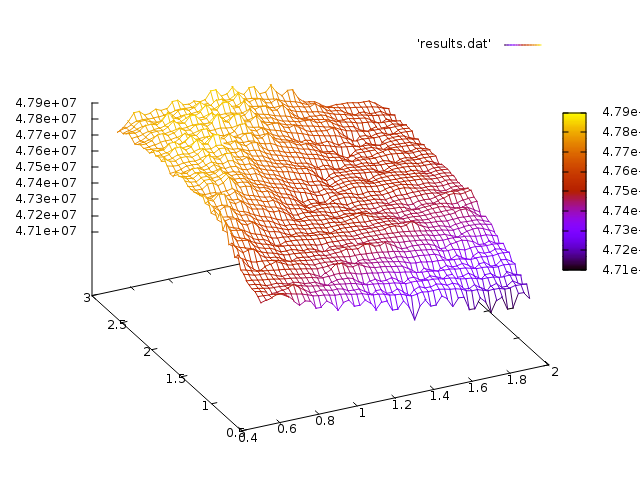

Hash Code 2018
==============

<https://hashcode.withgoogle.com/>

Results
-------

| File                | Score        |
| ------------------- | -----------: |
| a_example.in        |            4 |
| b_should_be_easy.in |       162415 |
| c_no_hurry.in       |     15800077 |
| d_metropolis.in     |     11642497 |
| e_high_bonus.in     |     20321247 |
| **total**           | **47926240** |

Target *search* scans evaluation function constants for best results. It outputs a file *results.dat* in *build* directory that you can open in *gnuplot*. To display data file, launch *gnuplot* and type following commands :

```gnuplot
set dgrid3d 50,50 qnorm 2
set hidden3d
splot 'results.dat' with lines palette
```

This shoud open a window and display something like:



*Enjoy!*
